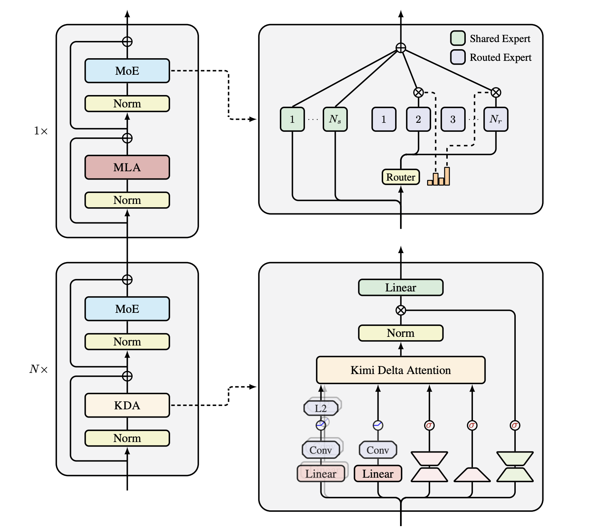

# Kimi Delta Attention (KDA)

**Kimi Delta Attention (KDA)** 是 Kimi 系列大模型在结构上最重要的创新之一。它由 Gated Delta Attention (GDA) 演化而来，二者的核心差异在于**衰减（decay）方式**：

- **GDA**：衰减因子是**标量**，所有通道共享同一个衰减系数，控制粒度较粗；
- **KDA**：衰减因子升级为**向量**，并构成对角矩阵 $\mathrm{Diag}(\alpha_t)$，从而实现**逐通道、细粒度**的门控。

## 状态更新公式

GDA 的状态更新：

$$
S_t = S_{t-1} \big( \alpha_t (I - \beta_t k_t k_t^{T}) \big) + \beta_t v_t k_t^{T}
$$

KDA 的状态更新：

$$
S_t = (I - \beta_t k_t k_t^{T}) \ \mathrm{Diag}(\alpha_t) \ S_{t-1} + \beta_t k_t v_t^{T} \in \mathbb{R}^{d_k \times d_v}
$$

$$
o_t = S_t^{T} q_t \in \mathbb{R}^{d_v}
$$

## 模型结构与计算路径

论文结构图中，KDA 各分量的计算可概括为：

$$
q_t^{h},\ k_t^{h} = \mathrm{L2Norm}\big(\mathrm{Swish}(\mathrm{ShortConv}(W_{q/k}^{h} x_t))\big) \in \mathbb{R}^{d_k}
$$

$$
v_t^{h} = \mathrm{Swish}(\mathrm{ShortConv}(W_v^{h} x_t)) \in \mathbb{R}^{d_v}
$$

$$
\alpha_t^{h} = f(W_{\alpha}^{\uparrow} W_{\alpha}^{\downarrow} x_t) \in [0, 1]^{d_k}
$$

$$
\beta_t^{h} = \mathrm{Sigmoid}(W_{\beta}^{h} x_t) \in [0, 1]
$$

对应到结构图右侧： $q$ / $k$ 经 Linear → Conv →（Swish）→ L2 Norm；v 经 Linear → Conv → Swish； $\alpha$ / $\beta$ 等门控量由低秩 / 线性投影再经激活得到。

## 实现要点

从公式与结构可以看出，KDA 使用了：

- 一维卷积（ShortConv）
- Swish / Sigmoid 激活
- L2 归一化

开源推理框架的实现也基本按上述路径落地。需要注意的是，论文中的 $f(\cdot)$ 被称为 **decay function（衰减函数）**，刻画在更新状态时对旧状态的保留程度。

在 SGLang 中，该衰减函数有两种写法：

| 写法 | 说明 |
|------|------|
| **standard** | Kimi 实际采用的写法，与 Mamba / GDA 经典形式一致 |
| **safe** | 数值更稳健的变体 |

当前 Kimi 使用的是 **standard** 写法。
